## **RAK2744aren konfigurazioa:**

**https://docs.rakwireless.com/Product-Categories/WisGate/RAK7244/Quickstart/#configuring-the-gateway**

### **RAK2744 EZAUGARRIAK:**

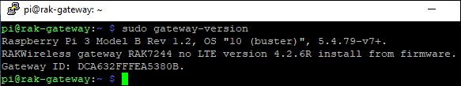{width="5.968903105861767in" height="1.2665113735783027in"}


### **Modo AP Wi-Fi**

De forma predeterminada, la puerta de enlace funcionará en modo Wi-Fi AP, lo que significa que puede encontrar un SSID con el nombre "Rakwireless_XXXX" en la lista de redes Wi-Fi de su PC.

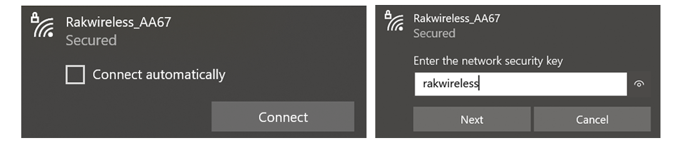{width="6.267716535433071in" height="1.3055555555555556in"}

-   Contraseña de Wi-Fi: `rakwireless`
-   Dirección IP predeterminada: `192.168.230.1`   

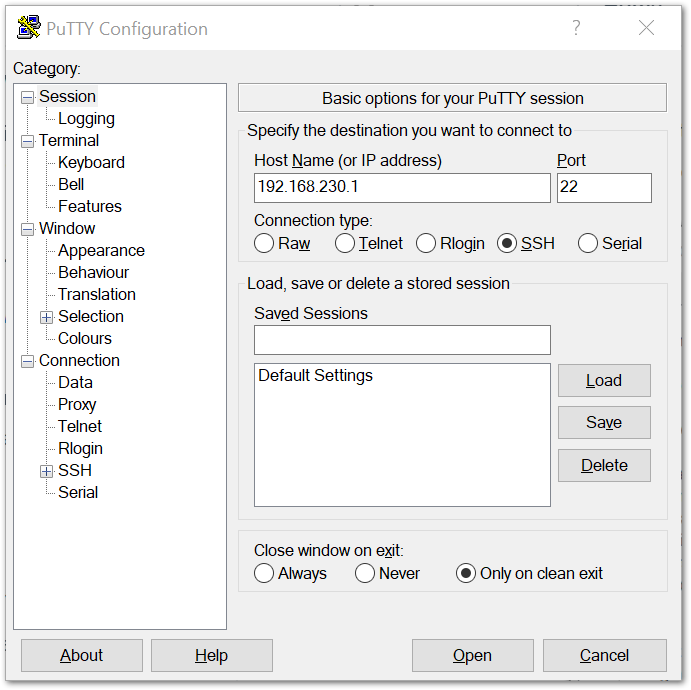{width="3.7031255468066493in" height="3.6969739720034998in"}

-   Nombre de usuario :  `pi `   

-   Contraseña :  `raspberry  `   

    ​

### **Accediendo a Internet**

Suponiendo que haya iniciado sesión con éxito en su Gateway usando SSH. Ingrese el siguiente comando en la línea de comando:

-   ```linux
    sudo gateway-config
    ```

    ​

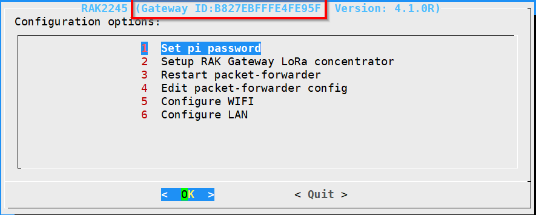{width="4.598958880139983in" height="1.9085673665791776in"}


### **Conéctese a través de Wi-Fi**

Si desea conectarse a través de Wi-Fi, puede hacerlo fácilmente con las capacidades inalámbricas de la Raspberry Pi 4 seleccionando " 5 Configurar WIFI ". De forma predeterminada, RAK7244 WisGate Developer D4 Gateway funciona en modo Wi-Fi AP. Para que la puerta de enlace se conecte al enrutador, debe funcionar en el modo de cliente Wi-Fi.

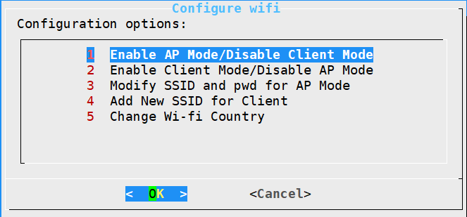{width="4.296875546806649in" height="2.079132764654418in"}

Hay 5 opciones para elegir en el menú de configuración de Wi-Fi:

1.  *Habilitar el modo AP / Deshabilitar el modo cliente* : la puerta de enlace funcionará en el modo de punto de acceso Wi-Fi después de reiniciar, mientras que el modo cliente Wi-Fi estará deshabilitado (este es el modo predeterminado).

2.  *Habilitar el modo cliente / deshabilitar el modo AP* : la puerta de enlace funcionará en el modo cliente Wi-Fi después de reiniciar, mientras que el modo Wi-FI AP estará deshabilitado.

3.  *Modificar SSID y pwd para el modo AP* : se utiliza para modificar el SSID y la contraseña del AP Wi-Fi. Solo funciona si el modo Wi-Fi AP está habilitado.

4.  *Agregar nuevo SSID para el cliente* : se usa si desea conectarse a una nueva red Wi-Fi. Solo funciona en modo Cliente Wi-Fi.

5.  *Cambiar país de Wi-Fi* : se utiliza para modificar el país de residencia para que coincida con los estándares de Wi-Fi.

> ⚠️ADVERTENCIA
>
> Para habilitar el modo de cliente Wi-Fi, primero debe deshabilitar el modo AP.

Una vez que se haya desactivado el modo Wi-Fi AP eligiendo " 2 Habilitar modo cliente / Deshabilitar modo AP ", ahora puede conectarse a una nueva red Wi-Fi eligiendo "4 Agregar nuevo SSID para cliente":

{width="4.369792213473316in" height="2.0935662729658793in"}

Ingrese el SSID de la red a la que desea conectarse:

> ⚠️ADVERTENCIA
>
> Asegúrese de ingresar el SSID y la contraseña de Wi-Fi correctos o no podrá volver a conectarse al RAK7244 a través de SSH en el modo AP de Wi-Fi. Si se queda atascado en esta situación, siga este procedimiento que se indica en la sección [Revertir al modo AP de Wi-Fi](https://docs.rakwireless.com/Product-Categories/WisGate/RAK7244/Quickstart/#reverting-to-wi-fi-ap-mode) , que es aplicable para que todas las puertas de enlace basadas en Raspberry Pi funcionen nuevamente en el modo AP de Wi-Fi.

```
sudo reboot
```

##### **Configuraciones opcionales**

Estas configuraciones en esta sección son solo opcionales y situacionales.

##### [\#](https://docs.rakwireless.com/Product-Categories/WisGate/RAK7244/Quickstart/#reverting-to-wi-fi-ap-mode)**Volver al modo AP de Wi-Fi**

En caso de que haya ingresado uno o ambos SSID y contraseña de Wi-Fi incorrectos en la configuración del modo de cliente Wi-Fi para que el RAK7244 WisGate Developer D4 Gateway se conecte al enrutador, siga estos pasos para que pueda volver a trabajar en Wi-Fi. -Fi AP Mode y rehaga la configuración.

-   Retire la tarjeta SD de su RAK7244 WisGate Developer D4 Gateway e insértela en su PC. Su PC debería poder detectarlo de la misma manera con la imagen a continuación:

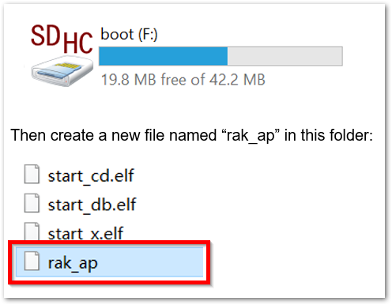{width="2.8802088801399823in" height="2.2382338145231846in"}

-   Usando su " Símbolo del sistema " o " Terminal ", navegue hasta su tarjeta SD y escriba este comando para generar el archivo " rak_ap ".

    -   ```cmd
        cd \> rak_ap
        ```

        ​


-   Compruebe si el archivo rak_ap se creó correctamente. Si es así, vuelva a insertar la tarjeta SD en su RAK7244 WisGate Developer D4 Gateway y debería funcionar nuevamente en el modo Wi-Fi AP.

**Configuración de la puerta de enlace**

Suponiendo que haya iniciado sesión con éxito en su Gateway usando SSH, ingrese el siguiente comando en la línea de comando:

```linux
sudo gateway-config
```

{width="4.62740813648294in" height="1.921253280839895in"}

1.  *Establecer contraseña pi* : se utiliza para establecer / cambiar la contraseña de la puerta de enlace.

2.  *Configure el concentrador LoRa de la puerta de enlace RAK* : se utiliza para configurar la frecuencia en la que funcionará la puerta de enlace y el servidor LoRaWAN con el que funcionará la puerta de enlace.

3.  *Restart packet -forwarder* : se utiliza para reiniciar el proceso de reenvío de paquetes LoRa.

4.  *Edite la configuración del reenvío de paquetes* : se utiliza para abrir el archivo global_conf.json, con el fin de editar los parámetros de LoRaWAN manualmente.

5.  *Configurar Wifi* : se utiliza para configurar los ajustes de Wi-Fi para conectarse a una red.

6.  *Configurar LAN* : se utiliza para configurar los ajustes del adaptador Ethernet.

> 📝 NOTA:
>
> Se generará una ID única para Gateway. Esto también se llama Gateway EUI al cuadrado en rojo en la figura anterior y es esencial para registrar el gateway con cualquier servidor de red LoRa (TTN, ChirpStack)

También hay otra forma de obtener su "ID de puerta de enlace", simplemente ingrese el comando a continuación en la línea de comando:

-   ```
    sudo gateway-version
    ```

    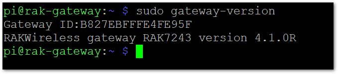{width="4.901042213473316in" height="1.074646762904637in"}


##### **Establecer una nueva contraseña para la puerta de enlace**

Es una buena práctica de seguridad cambiar la contraseña predeterminada " raspberry ", que es la misma en todos los dispositivos Raspberry Pi.

1.  Primero, elija la opción " 1 Establecer contraseña pi " referida en la imagen a continuación.

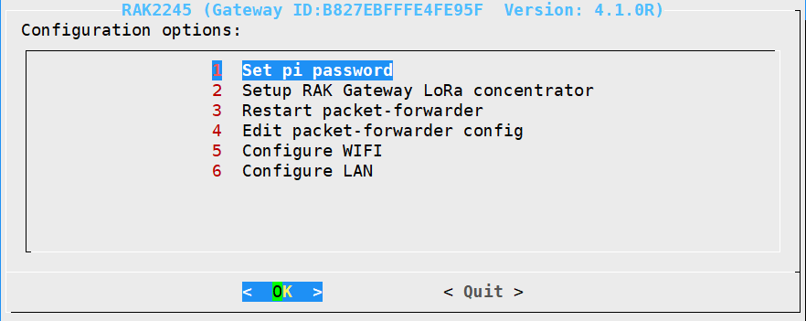{width="4.423838582677165in" height="1.72038167104112in"}

2.  A continuación, presione "Sí" y se le pedirá que ingrese su nueva contraseña dos veces y luego presione "Enter".

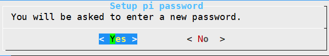{width="4.166872265966754in" height="0.7440846456692913in"}

3.  Muy bien, aparecerá el mensaje de éxito para cambiar la contraseña.

    ​

**Configuración del concentrador RAK Gateway LoRa**

Este menú le permite seleccionar su banda de frecuencia LoRa y una de las dos opciones de Servidor de redes disponibles eligiendo "2 Configurar el concentrador LoRa de puerta de enlace RAK"

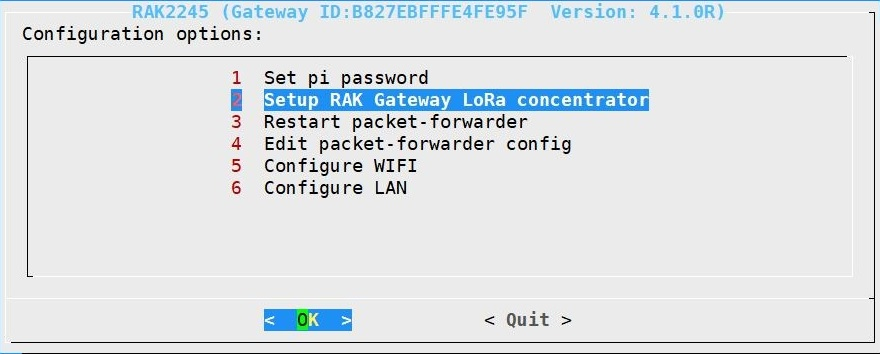{width="4.707277996500437in" height="1.859375546806649in"}

**Figura 25:** Elección de la configuración del concentrador LoRa de puerta de enlace RAK

Puede elegir uno de los dos servidores LoRa compatibles aquí: TTN o ChirpStack .


**El servidor es TTN**

-   TTN (The Things Network) : si elige TTN como el servidor LoRa, verá la siguiente página. Visite este [artículo (abre una nueva ventana)](https://www.thethingsnetwork.org/docs/lorawan/frequencies-by-country.html) para obtener más información sobre su plan de frecuencia TTN local. Esto le permitirá elegir el plan correcto.

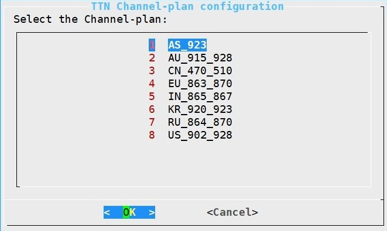{width="3.4099004811898515in" height="2.1264512248468943in"}

**Figura 27:** Selección del plan de canales TTN

Después de elegir la frecuencia correcta, aparecerá el mensaje de éxito como se muestra a continuación.


**TTN-ko datuak:**

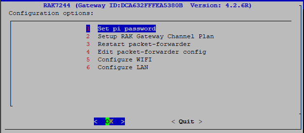{width="4.01298009623797in" height="1.9575513998250218in"}

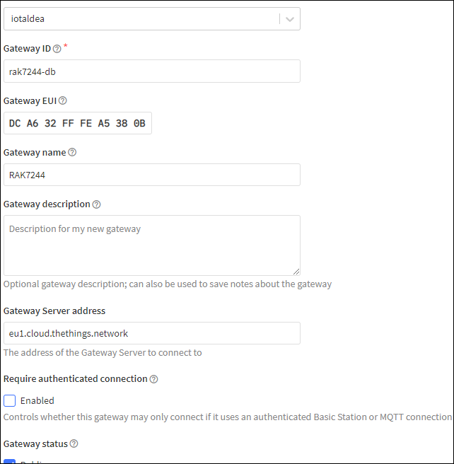{width="4.329683945756781in" height="4.14346019247594in"}

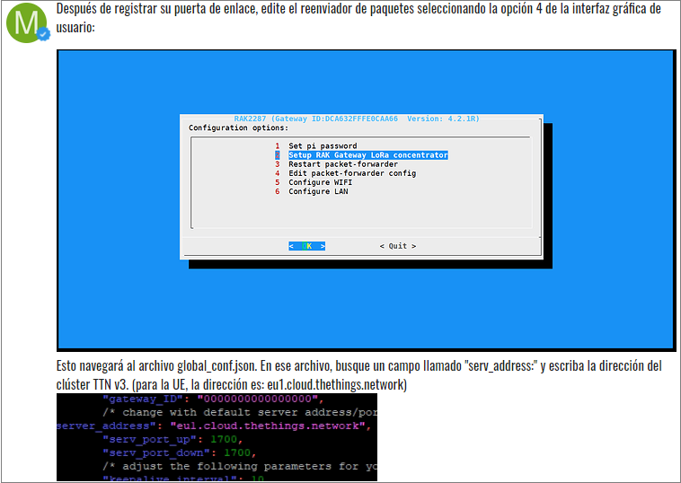
