> #### <https://www.youtube.com/watch?v=eVD5CSm58NY> (erabili dudan tutoriala)

#### **Mysql pasahitza**

Mysql password: iombi

```mysql
create user admin@'%' identified by 'iombi'
```

**PHPmyadminentzat datu base konkreturako pasahitza**

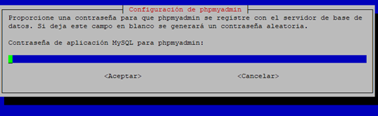


Erabiltzailea: admin

Pasahitza: iombi

```mysql
create database proba
use proba
create user admin with password 'admin' with all privileges
```

```mysql
create database dragino
use dragino
create user ivan with password 'ivan' with all privileges
```

TTGO otaa

DevEUI: 70B3D57ED004CDA0

AppEUI: Dena 0-koak

AppKey: 747F8C718A7EE9B092C319592C8D4D4C

DeviceID: ttgo-tracker-otaa

# [Instalación de InfluxDB en Raspberry Pi](https://pimylifeup.com/raspberry-pi-influxdb/)

1.  **Lo primero que debemos hacer antes de instalar InfluxDB en Raspberry Pi es asegurarnos de que todos los paquetes instalados actualmente estén actualizados.**

Podemos actualizar todos los paquetes instalados ejecutando los siguientes dos comandos.

```ubuntu
sudo apt update
sudo apt upgrade
```

2.  **Ahora que todo está actualizado, podemos continuar con la instalación de InfluxDB en Raspberry Pi.**

Nuestro siguiente paso es agregar la clave del repositorio InfluxDB a nuestra Raspberry Pi.

Agregar la clave permitirá que el administrador de paquetes en Raspbian busque en el repositorio y verifique los paquetes que se están instalando.

Podemos agregar la clave InfluxDB ejecutando el siguiente comando.

```
curl https://repos.influxdata.com/influxdb.key | gpg --dearmor | sudo tee /usr/share/keyrings/influxdb-archive-keyring.gpg >/dev/null
```

Este comando descargará la clave usando curl y la pasará directamente al programa "gpg" usando una tubería "|". Una vez que el llavero ha sido desarmado, se guarda en el directorio "/usr/share/keyrings/"

3.  Ahora que tenemos la clave del repositorio InfluxDB instalada en nuestra Raspberry Pi, debemos continuar y agregar su repositorio a la lista de fuentes. Ahora ingrese el siguiente comando para agregar el repositorio InfluxDB a la lista de fuentes. Asegúrese de elegir el comando correcto para la versión de Raspbian que está ejecutando.

```
echo "deb [signed-by=/usr/share/keyrings/influxdb-archive-keyring.gpg] https://repos.influxdata.com/debian $(lsb_release -cs) stable" | sudo tee /etc/apt/sources.list.d/influxdb.list
```


4.  **Con el repositorio agregado, ahora debemos continuar y actualizar la lista de paquetes nuevamente.**

Necesitamos hacer esto para que el administrador de paquetes apt busque paquetes en el repositorio que acabamos de agregar. El sistema operativo no hace esto automáticamente.

Ejecute el siguiente comando en su Raspberry Pi para actualizar la lista de paquetes.

```
sudo apt update
```

5.  **Ahora que hemos configurado el repositorio, ahora podemos continuar con la instalación del software InfluxDB.**

Para instalar InfluxDB en nuestra Raspberry Pi, todo lo que tenemos que hacer es ejecutar el siguiente comando.

```
sudo apt install influxdb
```

6.  **Con InfluxDB ahora instalado en nuestra Raspberry Pi, hagamos que comience en el arranque.**

Podemos hacer esto haciendo uso del administrador de servicios systemctl para habilitar nuestro archivo de servicio InfluxDB.

Ejecute los siguientes dos comandos para permitir que InfluxDB se inicie en el arranque de su Raspberry Pi.

```
sudo systemctl unmask influxdb
sudo systemctl enable influxdb
```

El primer comando que usamos desenmascara el archivo de servicio influxdb. Desenmascarar el servicio garantiza que podamos habilitarlo e iniciarlo, ya que un servicio enmascarado no se puede iniciar.

Nuestro segundo comando habilita el servicio influxdb. Este comando le indicará al administrador del servicio que vigile el archivo "influxdb.service" y configure el servicio en función de su contenido.

7.  **Ahora que todo se ha configurado, ahora podemos iniciar InfluxDB en nuestra Raspberry Pi.**

Para iniciar el servidor InfluxDB, necesitaremos ejecutar el siguiente comando. El administrador de servicios luego iniciará el servicio y comenzará a monitorearlo.

```
sudo systemctl start influxdb
```


# Usando InfluxDB en su Raspberry Pi

1.  **Como ahora hemos instalado InfluxDB, ahora podemos comenzar a hablar con la base de datos.**

Para hacer esto, necesitaremos iniciar la herramienta de línea de comandos de Influx ejecutando el siguiente comando.

No tiene que preocuparse por especificar una dirección para conectarse, ya que la herramienta detectará automáticamente la instalación local de InfluxDB.

Por defecto, InfluxDB no tiene configuración de usuarios. En nuestra próxima sección, exploraremos la creación de un usuario administrador para bloquear el acceso a su InfluxDB. Por ahora, sin embargo, exploraremos rápidamente InfluxDB.

**Influx**

2.  **InfluxDB no viene con bases de datos por defecto, por lo que nuestra primera tarea será crear una.**

Crear una base de datos es simple en InfluxDB y se puede hacer usando **"CREATE DATABASE \<DBNAME\>". **

```mysql
create database dragino
```


3.  **Antes de que podamos comenzar a modificar nuestra nueva base de datos, debemos decirle a la CLI que la "use".**

Usar una base de datos es tan simple como ejecutar el siguiente comando.

```mysql
use dragino
```


# Agregar autenticación a InfluxDB

1.  **El siguiente paso es agregar autenticación adicional a nuestra instalación de InfluxDB en Raspberry Pi. Sin autenticación, cualquiera podría interactuar con su base de datos.**

Para comenzar, primero debemos crear un usuario para que actúe como nuestro administrador.

Para crear este usuario, primero debemos cargar la herramienta CLI de InfluxDB ejecutando el siguiente comando.

**Influx**

2.  **Dentro de esta interfaz, podemos crear un usuario que tendrá acceso completo a la base de datos. Este usuario actuará como nuestra cuenta de administrador.**

Para crear este usuario administrador, ejecute el siguiente comando dentro de la herramienta CLI de InfluxDB.

Asegúrese de reemplazar \<**password**\> con una contraseña segura de su elección.

```
CREATE USER admin WITH PASSWORD '<password>' WITH ALL PRIVILEGES
```

*password = dragino*

Este comando creará un nuevo usuario llamado "admin" con la contraseña elegida y le otorgará todos los privilegios.

3.  **Una vez hecho esto, ahora puede salir de InfluxDB escribiendo "salir" y presionando ENTER**

4.  **Nuestro siguiente trabajo es modificar el archivo de configuración de InfluxDB para habilitar la autenticación.**

Podemos comenzar a editar el archivo usando el siguiente comando.

```
sudo nano /etc/influxdb/influxdb.conf
```

5.  **Dentro de este archivo, use CTRL + W para encontrar la sección \[HTTP\] y agregue las siguientes opciones debajo de esa sección.**

> *BUSCAR*
>

\[HTTP\]

> *AÑADIR DESPUÉS*
>

```
auth-enabled = true

pprof-enabled = true

pprof-auth-enabled = true

ping-auth-enabled = true
```


6.  **Una vez agregado, guarde el archivo presionando CTRL + X, luego Y, seguido de ENTER.**

7.  **Ahora, como hemos realizado cambios en la configuración de InfluxDB, tendremos que continuar y reiniciar el servicio usando el siguiente comando.**

Reiniciar el servicio garantizará que se lean nuestros cambios de configuración.

```
sudo systemctl restart influxdb
```


8.  **Como ahora hemos activado la autenticación de InfluxDB, necesitaremos ingresar nuestro nombre de usuario y contraseña antes de usar la herramienta CLI de InfluxDB.**

Puede usar el comando \"auth\" dentro de la herramienta o pasar el nombre de usuario y la contraseña a través de la línea de comando, como tenemos a continuación.

```
influx -username admin -password <password>
```


# Instalación de Grafana en Raspberry Pi

**http://pdacontroles.com/instalacion-completa-dashboard-grafana-en-raspberry-pi-3-b-b/**

**https://grafana.com/grafana/download?edition=oss&platform=arm**

1.  **Descargar paquete de Grafana desde la [web oficial](https://grafana.com/grafana/download?edition=oss&platform=arm), y elegimos la última versión y la edición OSS o Entreprise nos es indiferente en este punto. Elegimos la opción OSS (Open Source Software) de grafana para ARM.**

[**Open Source Software:**](https://openwebinars.net/blog/que-es-grafana-y-primeros-pasos/)

"Este es autoadministrado, donde puede administrar el análisis, la visualización y las alertas de todos sus datos, por lo que, puede instalar, administrar y mantener en su propia instancia."

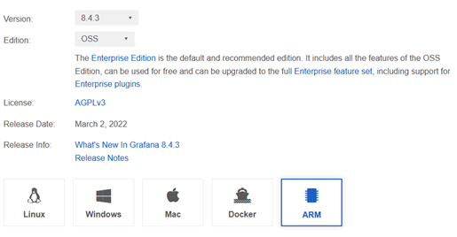

2.  **Actualizamos la lista de paquetes disponibles**

```
sudo apt update
```


3.  **Actualizamos paquetes y eliminamos paquetes obsoletos**

```
sudo apt upgrade -y
sudo apt autoremove -y
```


4.  **Descargamos el paquete de Grafana de la web con la opción para Ubuntu y Debian (ARMv7)**

```
sudo apt-get install -y adduser libfontconfig1
wget https://dl.grafana.com/oss/release/grafana_8.4.3_armhf.deb
```


5.  **Instalamos el paquete Grafana**

    ```
    sudo dpkg -i grafana_8.4.3_armhf.deb
    ```

    ​

6.  **Actualizamos paquetes y solucionamos la falta de paquetes faltantes**

```
sudo apt-get upgrade

sudo apt --fix-broken install
```


7.  **Configuramos el servicio y habilitamos el servicio Grafana y arrancamos el servicio**

```
sudo /bin/systemctl daemon-reload
sudo /bin/systemctl enable grafana-server
sudo /bin/systemctl start grafana-server
```


8.  **Una vez realizados todos los pasos accedemos a la URL donde está alojado Grafana (IP de la raspberry:3000) y realizamos el login.**

La primera vez tanto el **usuario** como la **contraseña** por defecto son: **admin/admin**

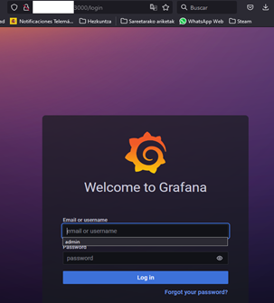

Luego de registrarse permitirá cambiar el usuario y la contraseña


Usuario: **admin** / Contraseña: **iompi**


# Enlazar la BBDD de InfluxDB con Grafana

1.  **Añadimos una nueva BBDD desde Grafana, desde la opción "Data Sources" y elegimos InfluxDB**

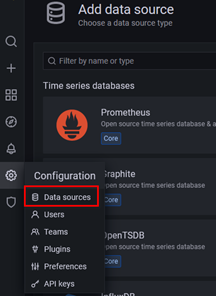{width="2.2549179790026246in" height="3.0881299212598425in"} 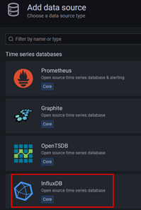

2.  **En el siguiente paso configuraremos las opciones de conexión con la BBDD**

Le ponemos el nombre que queramos a la conexión (**Name: Dragino_2**), la URL donde está instalado InfluxDB, nuestro caso la propia Raspberry (**localhost:8086**)

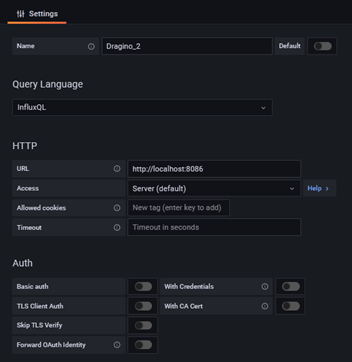{width="3.670041557305337in" height="3.7761122047244093in"}

3.  **También añadiremos el nombre de la BBDD que hemos creado con anterioridad en InfluxDB, en el punto 2 del apartado [Usando InfluxDB en su Raspberry Pi](#usando-influxdb-en-su-raspberry-pi) y tanto el usuario como la contraseña del usuario que tenga acceso privilegiado a esa BBDD.**

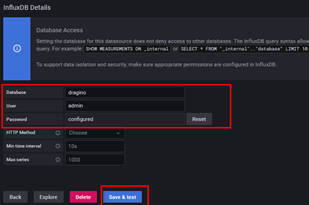{width="3.2177416885389327in" height="2.140495406824147in"}

4.  **Seleccionamos "Save & test" y el programa nos tiene que devolver el mensaje "Data source is working"**

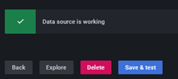{width="2.3229571303587053in" height="1.0432436570428696in"}

5.  **Ahora vamos a la opción de creación del Dashboard**

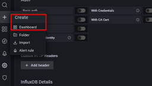{width="2.6702405949256343in" height="1.506149387576553in"}

6.  **Ahora añadiremos un nuevo panel**

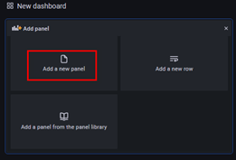{width="2.715094050743657in" height="1.842798556430446in"}

7.  **Editamos el query del panel para elegir los datos de lectura del nodo**

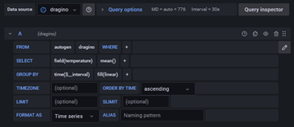{width="3.788510498687664in" height="1.6438867016622922in"}

8.  **Ahora podemos ver los datos visualizados en el gráfico**

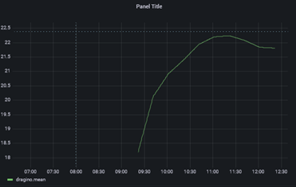{width="3.861365923009624in" height="2.4465004374453194in"}

9.  **Ahora le daremos a guardar "save" y le podremos un nombre al Dashboard**

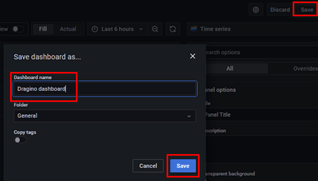 

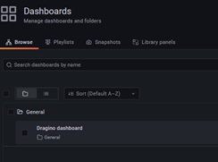

10. **El último punto será empotrar este panel en Node-Red, para poder visualizarlo desde allí**

Habrá que elegir el Dashboard que queremos visualizar en el Node-Red y entre las opciones elegir Share. En el Panel "Share Panel" elegir "Embed" y "Copy to clipboard". Este código será el que utilizaremos en Node-Red.

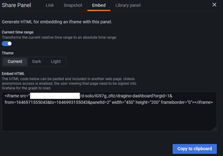{width="3.852989938757655in" height="2.6962773403324585in"}

11. **Volviendo a Node-Red en la URL [http://IP:1880/](http://ip:1880/) y seleccionando la opción Dashboard (para ello habremos importado la paleta *node-red-dashboard* con las siguientes opciones disponibles**

    > Seleccionamos +group
    >
    > Editamos el Group
    >
    > Elegimos el nombre ‘**Dragino probak**’ y la anchura del grupo ‘**30**’ y elegir “Update”

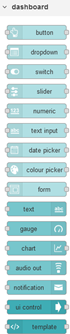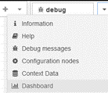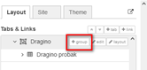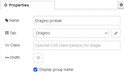

12. **En este punto se añade el nodo de Template al flow de Node-Red y al abrir el template y se edita el "group", "size" y se pega el HTML embebido del punto 10.**

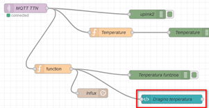{width="3.1325503062117237in" height="1.6255818022747157in"} 

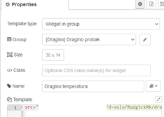{width="4.712057086614173in" height="0.44228674540682417in"}

13. **Habrá que ajustar el "Size" así como el "width = 1500" "height=750" para adaptar el tamaño de la pantalla**

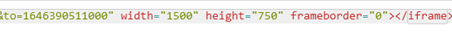

14. **Haz "Deploy" y elige el botón de la flecha. Esto lanzará el Dashboard del Node-Red con el Dashboard de Grafana embebido.**

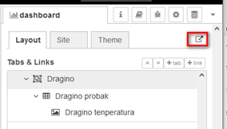{width="2.9583278652668414in" height="1.6874464129483815in"}


# Enlazar la BBDD de MySQL con Node-Red

1.  **Crear una BBDD en phpMyAdmin**

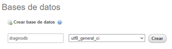{width="3.517166447944007in" height="1.0067968066491688in"}

2.  **Crear una tabla para visualizar los datos, con 4 columnas que serán los datos que manejaremos nosotros del nodo, empezando por un id (identificador que será único para cada línea de la tabla)**

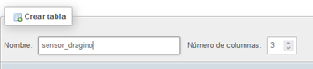{width="3.576545275590551in" height="0.7873742344706912in"}

3.  **La primera columna será un ID que se autoincrementará y la utilizaremos como el primari key**

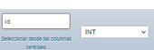{width="1.7726192038495188in" height="0.5684350393700788in"}

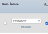

4.  **Ahora introducimos los valores de nuestras 3 columnas (Nombre = temperatura, tipo = decimal, longitud/valores = 10,2 y lo mismo para la humedad y por último la fecha de creación del dato (en formato 'datetime' o 'timestamp')**

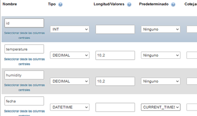{width="4.136169072615923in" height="2.4311832895888013in"}

5.  **Una vez creado la tabla y las columnas volvemos a Node-Red y creamos una nueva función para que los datos se escriban en la BBDD MySQL**

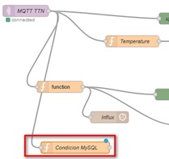

6.  **Añadimos el nodo de MySQL desde la paleta de opciones y ahora la añadimos a nuestro flow**

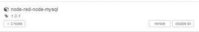{width="0.7331036745406824in" height="1.272328302712161in"}

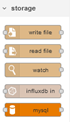

7.  **Escriba el nombre de su base de datos como la creó anteriormente y asígnele un nombre, luego haga clic en el icono de lápiz junto a la base de datos para editar el nodo sqldatabase.**

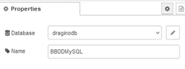{width="2.7401957567804023in" height="1.0199617235345582in"}

8.  **Editamos el nodo sqldatabse del siguiente modo y nos tiene que aparecer que la BBDD está conectado**

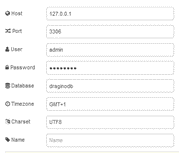{width="1.8609448818897638in" height="1.5943635170603674in"} 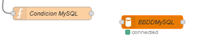

9.  **Nos faltaría conectar los nodos entre sí y ver que funciona todo "ok"**

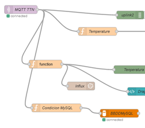{width="2.509086832895888in" height="2.219122922134733in"}

10. **Deberíamos de poder ver los datos que se van escribiendo en nuestra BBDD de MySQL**

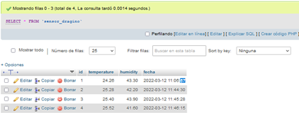
